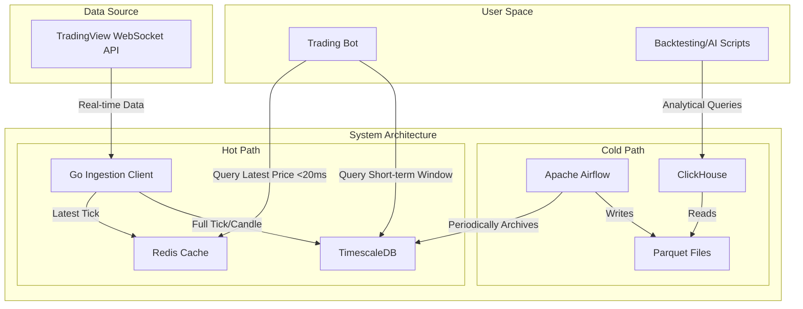
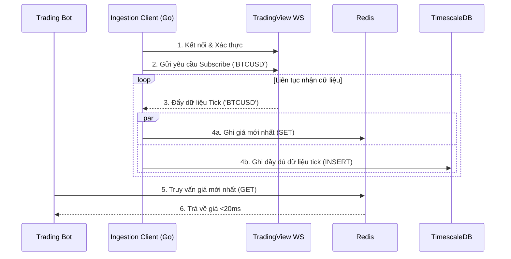

# **HFT Data Lakehouse Blueprint - Architecture Document**

## **Phần 1: Giới thiệu (Introduction)**

Tài liệu này phác thảo kiến trúc tổng thể cho dự án **HFT Data Lakehouse Blueprint**, bao gồm các hệ thống backend, dịch vụ chia sẻ, và các vấn đề không liên quan đến UI. Mục tiêu chính của nó là đóng vai trò như một bản thiết kế kiến trúc chỉ đạo cho quá trình phát triển, đảm bảo tính nhất quán và tuân thủ các mẫu và công nghệ đã chọn.

  * **Starter Template or Existing Project:** N/A - Đây là một dự án greenfield (xây dựng mới hoàn toàn).
  * **Nhật ký thay đổi (Change Log):**

| Ngày | Phiên bản | Mô tả | Tác giả |
| :--- | :--- | :--- | :--- |
| 01/10/2025 | 1.0 | Tạo bản nháp kiến trúc đầu tiên | Winston (Architect) |

## **Phần 2: Kiến trúc tổng thể (High-Level Architecture)**

#### **Tóm tắt kỹ thuật**

Kiến trúc được đề xuất là một hệ thống dữ liệu lai (hybrid) mã nguồn mở, có thể tự host. Hệ thống sử dụng Go cho việc thu thập dữ liệu (ingestion) hiệu năng cao, tách biệt thành một "luồng nóng" (hot path) dùng Redis và TimescaleDB cho truy vấn real-time, và một "luồng lạnh" (cold path) dùng Airflow, Parquet, ClickHouse cho phân tích dữ liệu lịch sử. Toàn bộ dự án sẽ được quản lý trong một Monorepo và triển khai qua Docker để đảm bảo tính nhất quán.

#### **Sơ đồ kiến trúc tổng thể**



#### **Các mẫu kiến trúc và thiết kế (Architectural and Design Patterns)**

  * **Kiến trúc Dữ liệu Lai (Hybrid Hot/Cold Data Architecture):** Tách biệt luồng dữ liệu để cân bằng giữa nhu cầu truy vấn real-time độ trễ cực thấp (hot) và khả năng phân tích dữ liệu lớn một cách hiệu quả về chi phí (cold).
  * **Xử lý theo lô (Batch Processing / ETL):** Sử dụng Airflow để định kỳ trích xuất, biến đổi và tải dữ liệu từ hot storage sang cold storage. Phù hợp cho việc lưu trữ và chuẩn bị dữ liệu phân tích.
  * **Repository Pattern (Đề xuất):** Trừu tượng hóa tầng truy cập dữ liệu (trong Go client và Python script), giúp logic nghiệp vụ không bị phụ thuộc trực tiếp vào Redis, TimescaleDB hay ClickHouse, làm cho code dễ kiểm thử và bảo trì hơn.

## **Phần 3: Bộ công nghệ (Tech Stack)**

#### **Hạ tầng (Infrastructure)**

  * **Nền tảng:** Tự host (Self-hosted)
  * **Mô hình triển khai MVP:** Sử dụng Docker và Docker Compose trên một hoặc nhiều máy chủ Linux.

#### **Bảng Công nghệ (Technology Stack Table)**

| Hạng mục | Công nghệ | Phiên bản (Đề xuất) | Mục đích | Lý do |
| :--- | :--- | :--- | :--- | :--- |
| **Ngôn ngữ** | Golang | 1.2x.x | Xây dựng Ingestion Client | Hiệu năng cao, xử lý đồng thời tốt (NFR4). |
| **Ngôn ngữ** | Python | 3.1x.x | Viết script cho Airflow | Hệ sinh thái mạnh cho xử lý dữ liệu (Pandas/Polars). |
| **Hot Storage**| Redis | 7.x | Cache dữ liệu tick mới nhất | Tốc độ truy vấn key-value cực nhanh (NFR1). |
| **Hot Storage**| TimescaleDB | 2.x (trên PostgreSQL 16) | Lưu dữ liệu nóng ngắn hạn | Tối ưu cho truy vấn chuỗi thời gian, dùng SQL (FR6). |
| **Cold Storage**| ClickHouse | 24.x | Query Engine cho dữ liệu lạnh | Tốc độ truy vấn phân tích vượt trội trên dữ liệu lớn (FR5). |
| **Orchestration**| Apache Airflow | 2.x.x | Điều phối pipeline xử lý lô | Chuẩn công nghiệp, linh hoạt, mã nguồn mở (FR4). |
| **Kiểm thử** | Pytest | 8.x | Unit/Integration test cho Python | Framework kiểm thử mạnh mẽ và phổ biến cho Python. |
| **Triển khai** | Docker / Docker Compose | 26.x / 2.x | Đóng gói và vận hành | Đảm bảo tính nhất quán và đơn giản hóa việc triển khai (NFR2). |

## **Phần 4: Mô hình Dữ liệu (Data Models)**

#### **Mô hình 1: Dữ liệu Tick (TickData)**

  * **Mục đích:** Lưu trữ mọi biến động giá nhỏ nhất của một symbol, bao gồm cả giá mua/bán tốt nhất, cung cấp dữ liệu có độ phân giải cao nhất.
  * **Các thuộc tính chính:**
      * `timestamp` (timestamptz): Thời gian chính xác của tick.
      * `symbol` (text): Mã giao dịch (ví dụ: 'BTCUSD').
      * `bid` (decimal): Giá mua tốt nhất.
      * `ask` (decimal): Giá bán tốt nhất.
      * `price` (decimal): Giá khớp lệnh cuối cùng (có thể không có ở mọi tick).
      * `volume` (decimal): Khối lượng giao dịch của tick đó (nếu có).
  * **Mối quan hệ:** Một `TickData` thuộc về một `Symbol`.

#### **Mô hình 2: Dữ liệu Nến (CandlestickData)**

  * **Mục đích:** Lưu trữ dữ liệu thị trường đã được tổng hợp (Mở, Cao, Thấp, Đóng, Khối lượng) theo các khung thời gian cụ thể (1M, 5M, 1H, etc.).
  * **Các thuộc tính chính:**
      * `timestamp` (timestamptz): Thời gian bắt đầu của khung thời gian của nến.
      * `symbol` (text): Mã giao dịch.
      * `interval` (text): Khung thời gian của nến (ví dụ: '1M', '5M', '1H').
      * `open` (decimal): Giá mở cửa.
      * `high` (decimal): Giá cao nhất.
      * `low` (decimal): Giá thấp nhất.
      * `close` (decimal): Giá đóng cửa.
      * `volume` (decimal): Tổng khối lượng giao dịch.
  * **Mối quan hệ:** Một `CandlestickData` thuộc về một `Symbol` và một `Interval`.

## **Phần 5: Các thành phần (Components)**

  * **1. Ingestion Client:** Dùng Go, kết nối tới TradingView WebSocket, nhận, phân tích và chuyển tiếp dữ liệu tới Hot Storage.
  * **2. Real-time Cache:** Dùng Redis, chỉ lưu trữ giá trị tick mới nhất cho mỗi symbol để bot đọc cực nhanh.
  * **3. Short-term Store:** Dùng TimescaleDB, lưu trữ lịch sử dữ liệu nóng ngắn hạn (vài ngày) cho phân tích.
  * **4. Batch Processing Orchestrator:** Dùng Apache Airflow, quản lý và lên lịch cho tác vụ ETL.
  * **5. Processing Script:** Dùng Python, chứa logic ETL đọc từ TimescaleDB và ghi ra file Parquet.
  * **6. Analytical Query Engine:** Dùng ClickHouse, cung cấp giao diện SQL để truy vấn các file Parquet trong Cold Storage.

## **Phần 6: Các API bên ngoài (External APIs)**

  * **API:** TradingView WebSocket API
  * **Mục đích:** Nguồn dữ liệu real-time duy nhất cho toàn bộ hệ thống.
  * **Xác thực:** Sử dụng `username` và `password` của tài khoản TradingView, quản lý qua biến môi trường.
  * **Các Endpoint chính:**
      * **WebSocket URL:** `wss://data.tradingview.com/socket.io/websocket`
      * **Symbol Search API:** `https://symbol-search.tradingview.com/symbol_search`
      * **Sign-in URL:** `https://www.tradingview.com/accounts/signin/`

## **Phần 7: Luồng hoạt động cốt lõi (Core Workflows)**

Sơ đồ tuần tự minh họa luồng thu thập và truy vấn dữ liệu real-time:



***Ghi chú:*** *Bước 4a và 4b được thực hiện đồng thời (concurrently) bằng goroutines trong Go để đảm bảo việc ghi vào TimescaleDB không làm chậm việc ghi vào Redis.*

## **Phần 8: Sơ đồ Database (Database Schema)**

#### **1. TimescaleDB**

```sql
CREATE TABLE ticks (
    "time" TIMESTAMPTZ NOT NULL,
    symbol TEXT NOT NULL,
    bid DECIMAL,
    ask DECIMAL,
    price DECIMAL,
    volume DECIMAL
);
SELECT create_hypertable('ticks', 'time');

CREATE TABLE candles (
    "time" TIMESTAMPTZ NOT NULL,
    symbol TEXT NOT NULL,
    interval TEXT NOT NULL,
    open DECIMAL,
    high DECIMAL,
    low DECIMAL,
    close DECIMAL,
    volume DECIMAL
);
SELECT create_hypertable('candles', 'time');

CREATE INDEX ON ticks (symbol, "time" DESC);
CREATE INDEX ON candles (symbol, interval, "time" DESC);
```

#### **2. Redis**

  * **Cấu trúc key:** `latest_tick:{symbol}` (Ví dụ: `latest_tick:BTCUSD`)
  * **Loại dữ liệu:** **Hash** (chứa các trường: `bid`, `ask`, `price`, `volume`, `timestamp`).

#### **3. ClickHouse**

```sql
CREATE TABLE ticks_cold (
    `time` DateTime64(9, 'UTC'),
    `symbol` String,
    `bid` Decimal(18, 8),
    `ask` Decimal(18, 8),
    `price` Decimal(18, 8),
    `volume` Decimal(18, 8)
) ENGINE = S3('path/to/data/*.parquet', 'Parquet');
```

## **Phần 9: Cấu trúc thư mục (Source Tree)**

```plaintext
hft-lakehouse/
├── apps/
│   ├── ingestion-client/      # Ứng dụng Go
│   └── processing-job/        # Script Python
├── dags/                      # DAGs của Airflow
├── data/
│   └── cold_storage/          # Chứa file Parquet
├── scripts/                   # Script hỗ trợ, benchmark
├── docs/
│   ├── prd.md
│   └── architecture.md
├── docker-compose.yml
├── .env.example
└── README.md
```

## **Phần 10: Hạ tầng và Triển khai (Infrastructure and Deployment)**

  * **Công cụ:** Docker Compose cho MVP trên một máy chủ tự host.
  * **Chiến lược:** Triển khai thủ công bằng cách pull code mới nhất và chạy lại `docker-compose up -d --build`.
  * **Rollback:** Quay lại commit trước đó trong Git và triển khai lại.

## **Phần 11: Chiến lược Xử lý lỗi (Error Handling Strategy)**

  * **Logging:** Định dạng JSON, sử dụng `slog` cho Go và `logging` cho Python.
  * **Retry:** Ingestion client phải có cơ chế retry với exponential backoff khi kết nối tới TradingView.
  * **Idempotency:** Tác vụ xử lý lô của Airflow phải được thiết kế để chạy lại nhiều lần mà không tạo dữ liệu trùng lặp.

## **Phần 12: Tiêu chuẩn code (Coding Standards)**

  * **Core:** Tuân thủ `go fmt` và `black`/`ruff`. Test file đặt cạnh file code.
  * **Critical Rules:**
    1.  Không truy cập trực tiếp biến môi trường.
    2.  Không hardcode credentials.
    3.  Chỉ dùng structured logging.
    4.  Truy cập database qua Repository Pattern.
    5.  Sử dụng `context.Context` trong Go cho các tác vụ I/O.

## **Phần 13: Chiến lược Kiểm thử (Test Strategy)**

  * **Tiếp cận:** Test-After cho MVP, tập trung vào Unit Test và Integration Test.
  * **Mục tiêu:** Độ bao phủ \>70% cho logic nghiệp vụ mới.
  * **Hạ tầng:** Integration test sẽ chạy trên môi trường Docker Compose riêng biệt.

## **Phần 14: Bảo mật (Security)**

  * **Secrets:** Quản lý 100% qua biến môi trường.
  * **Kết nối:** Sử dụng WSS và TLS/SSL cho các kết nối.
  * **Dependencies:** Quét lỗ hổng bảo mật bằng các công cụ tự động như Dependabot.
