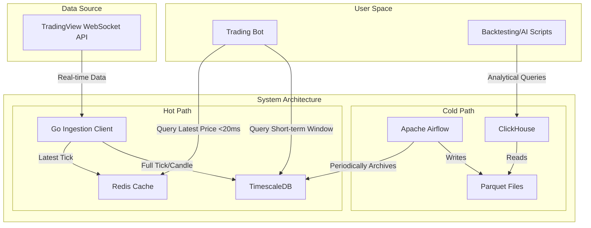

# **Phần 2: Kiến trúc tổng thể (High-Level Architecture)**

#### **Tóm tắt kỹ thuật**

Kiến trúc được đề xuất là một hệ thống dữ liệu lai (hybrid) mã nguồn mở, có thể tự host. Hệ thống sử dụng Go cho việc thu thập dữ liệu (ingestion) hiệu năng cao, tách biệt thành một "luồng nóng" (hot path) dùng Redis và TimescaleDB cho truy vấn real-time, và một "luồng lạnh" (cold path) dùng Airflow, Parquet, ClickHouse cho phân tích dữ liệu lịch sử. Toàn bộ dự án sẽ được quản lý trong một Monorepo và triển khai qua Docker để đảm bảo tính nhất quán.

#### **Sơ đồ kiến trúc tổng thể**

#### **Các mẫu kiến trúc và thiết kế (Architectural and Design Patterns)**

  * **Kiến trúc Dữ liệu Lai (Hybrid Hot/Cold Data Architecture):** Tách biệt luồng dữ liệu để cân bằng giữa nhu cầu truy vấn real-time độ trễ cực thấp (hot) và khả năng phân tích dữ liệu lớn một cách hiệu quả về chi phí (cold).
  * **Xử lý theo lô (Batch Processing / ETL):** Sử dụng Airflow để định kỳ trích xuất, biến đổi và tải dữ liệu từ hot storage sang cold storage. Phù hợp cho việc lưu trữ và chuẩn bị dữ liệu phân tích.
  * **Repository Pattern (Đề xuất):** Trừu tượng hóa tầng truy cập dữ liệu (trong Go client và Python script), giúp logic nghiệp vụ không bị phụ thuộc trực tiếp vào Redis, TimescaleDB hay ClickHouse, làm cho code dễ kiểm thử và bảo trì hơn.

