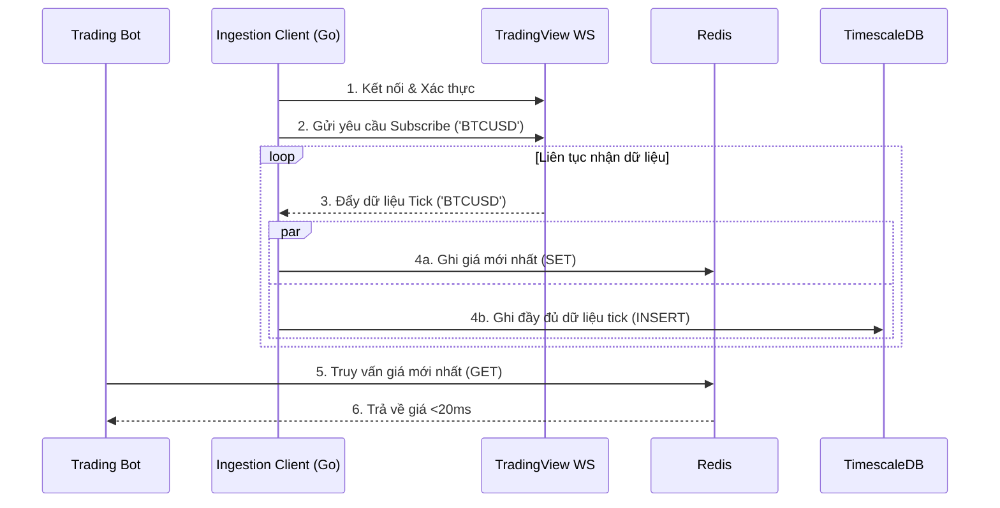

# **Phần 7: Luồng hoạt động cốt lõi (Core Workflows)**

Sơ đồ tuần tự minh họa luồng thu thập và truy vấn dữ liệu real-time:

***Ghi chú:*** *Bước 4a và 4b được thực hiện đồng thời (concurrently) bằng goroutines trong Go để đảm bảo việc ghi vào TimescaleDB không làm chậm việc ghi vào Redis.*

